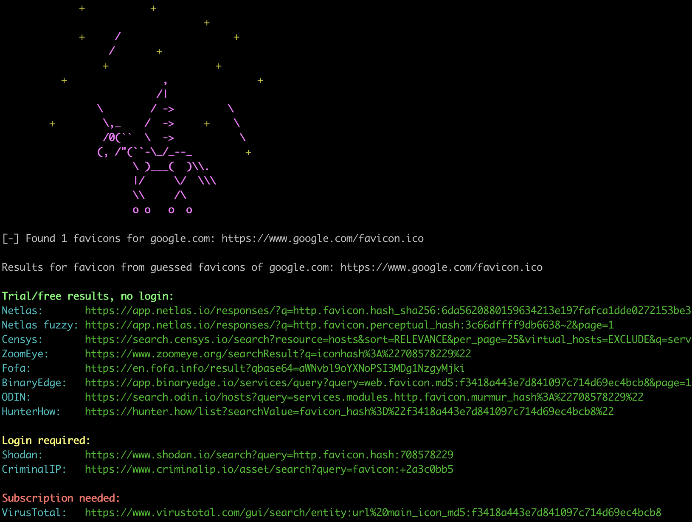

# FAVICORN 💖🦄

**All-sources tool to search websites by favicons.**

## The mechanism

Favicorn takes a favicon and provides search result links across 10 platforms.

Drop a ⭐ on the repo, and we’ll add automated scraping for all sources!



## Usage

There are 3 search modes:
* search by direct favicon URL;
* search by file;
* and search by domain (guessing possible favicons).

Search by a specific favicon URL (`--uri`, `-u`):
```sh
./favicorn.py -u https://emojipedia.org/images/favicon-32x32.png
```

Search by a favicon file (`--file`, `-f`):
```sh
./favicorn.py -f test-favicon.png
```

Search by a domain, resolving to IPs and checking their favicons (`--domain`, `-d`):
```sh
./favicorn.py -d google.com
```

### Additional options

Show favicon hashes for a search (`--verbose`): `./favicorn.py -d google.com -v`

Get additional favicon versions using search engines (`--add-from-search-engines`, `-e`):
`./favicorn.py -d google.com -e`

Save all links to the specific file (`-s`, `--save-links-filename`): `./favicorn.py -d google.com -s links.txt`

Give tinyurl links instead of full links for platforms: `--tinyurl`
Show only links to platforms, don't extract preview of results: `--no-fetch`
Disable unicorn animation (dangerous option, use with caution!): `--no-logo`

## Preview of results

By default, Favicorn generates links to search for websites by their favicon
across all known platforms, and then retrieves the first pages of results from some of them.

Currently, ZoomEye, Shodan (key required), and Netlas (key required) are supported.

Export API keys in the following way:
```
export SHODAN_KEY=...
export NETLAS_KEY=...
```

## Supported platforms

| Name        | Login required |
|-------------|----------------|
| ZoomEye     | yes            |
| Shodan      | yes            |
| Fofa        | no             |
| VirusTotal  | yes            |
| BinaryEdge  | yes            |
| Netlas      | no             |
| Censys      | no             |
| ODIN        | no             |
| CriminalIP  | yes            |
| HunterHow   | yes            |

## Use cases

- Search for phishing domains & brand protection
    - [Andrea Fortuna: Favicon Forensics: hunting phishing sites with Shodan](https://andreafortuna.org/2024/09/18/unmasking-digital-deception-leveraging-shodan-and-favicon-hashes-to-detect-phishing-sites)
- Extend your scope for pentesting
   - [Devansh batham: Weaponizing favicon.ico for BugBounties , OSINT and what not](https://medium.com/@Asm0d3us/weaponizing-favicon-ico-for-bugbounties-osint-and-what-not-ace3c214e139)
- Search for C2 (command and control) servers of hackers
- Research purposes, you have to think bigger

## Other relevant tools

- [Favicon-Search](https://github.com/truda8/Favicon-Search)
- [favihunter](https://github.com/eremit4/favihunter)
- [favfound](https://github.com/elihypoo414/favfound)
- [favicon](https://github.com/scottwernervt/favicon)
- [pyfav](https://github.com/phillipsm/pyfav)
- [besticon (favicon-service)](https://github.com/mat/besticon/)
- [favicongrabber.com](https://github.com/antongunov/favicongrabber.com)
- [favicheck](https://github.com/szTheory/favicheck)
- [favicon-hash](https://favicon-hash.kmsec.uk/)

## Testing

```sh
python3 -m unittest test_favicorn.py
```

## Thanks :purple_heart:

Thanks for [@soxoj](https://github.com/soxoj), who was an inspirer, muse, auditor of my pure code and for his huge peace of development. Also i'm grateful for one of the most vibrant OSINT communities for testing this project. Do not hesitate to provide something interesting or fix our bugs! But don't forget, it's not a just another boring swiss-knife.

